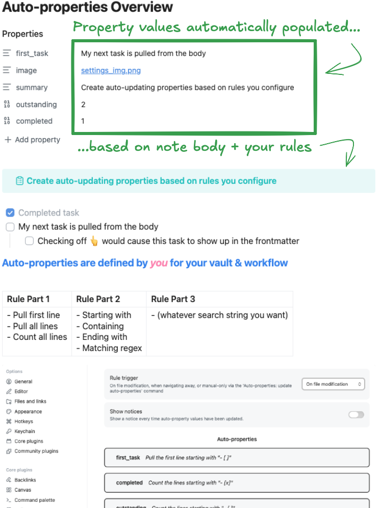
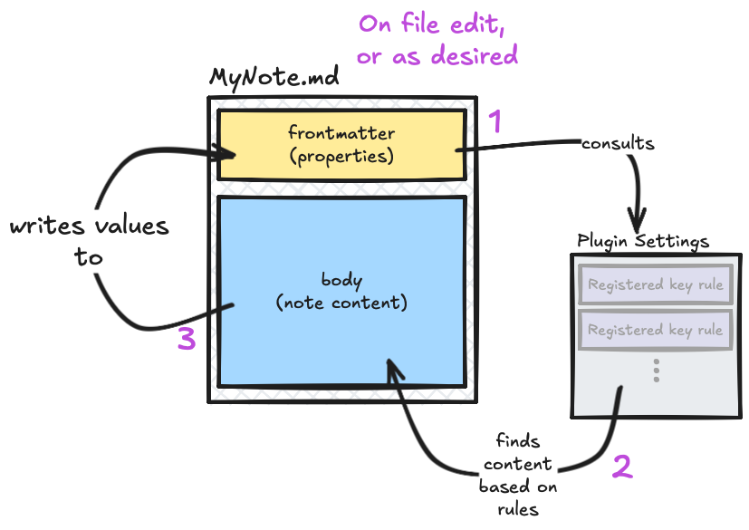
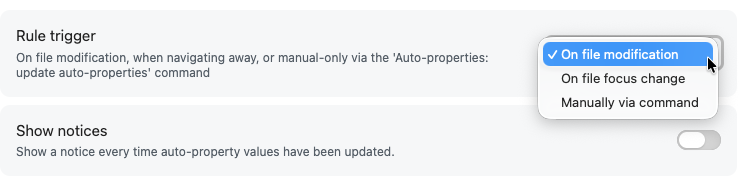
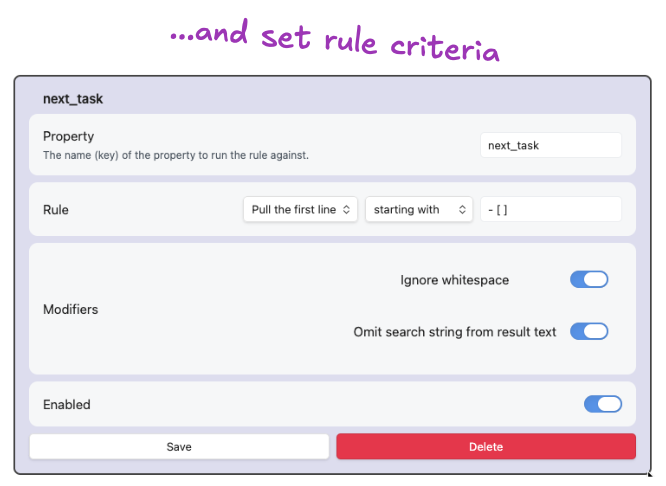

# Auto-properties Plugin

> [!TIP] 
> **TL;DR** - Create auto-updating properties based on rules

This is an [Obsidian](https://obsidian.md) plugin which creates automatically-updating note properties based on user-defined rules. This pairs nicely with bases and templates.

# [👉 Demo Video 👈](https://www.youtube.com/watch?v=IPDsfYfXp4Y)

## Example

## Overview

This plugin updates frontmatter of your notes using rules that act on their body (content).

# Use

## How
1. Install & enable plugin - open `Auto-Property` settings
2. Decide how often you want the auto-properties to update

3. Create your first auto-property & configure its rule criteria.
   

4. Add your property's key to your notes
5. Done! Your notes willl then update the property values automatically however often you've configured

### Rule Criteria

- **Key** - the property name the rule will be applied to in your notes
- **Rule** - end up being readable sentences that say what the rule does:

| Rule Part 1                                                | Rule Part 2                                                          | Rule Part 3                         |
| ---------------------------------------------------------- | -------------------------------------------------------------------- | ----------------------------------- |
| - Pull first line - Pull all lines - Count all lines | - Starting with - Containing - Ending with - Matching regex | (whatever search string you want) |

- **Modifiers** - change how rules apply or are shown
	- *Ignore whitespace* - whether or not "starts with" should care about indention
	- *Omit search string from result text* - allows you to not include whatever text you are using in the text input field of the rule
	- *Case sensitive* - whether or not "THIS" is the same as "tHiS"
- **Enabled** - you can toggle rules on/off without deleting them

## Use Cases

My use case was based on pulling the first open task into a property... but you can do much more.

- All open tasks
- First open task
- First task with status
- First line with tag (text)
- All lines with whatever text
- First embed image

# Design Considerations

## You specify the keys & rules

You have control over the keys (property names) you do and don't want to have rules for. You control what the rules do.

## Note bodies are never changed

This plugin **only updates note properties**. It will not update the body of the note, by design.

## Few "smart" touches

The plugin tries to do as little "magic under the hood" stuff as possible - but does do a couple of things to work better with how Obsidian works.

- targeting embeds (via search string `![[`) will convert to a clickable link
- targeting blocks that have a block ID will convert to a clickable link to that block
  - i.e. it will make links for blocks ending with a space, carrot, and some text ^likethis