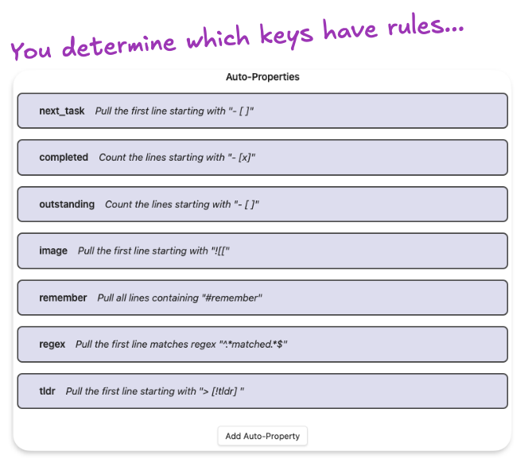

# Auto-properties Plugin

> [!tip] Create auto-updating properties based on rules

This is an [Obsidian](https://obsidian.md) plugin which creates automatically-updating note properties based on user-defined rules. This pairs nicely with bases and templates.

## Demo Video

[Watch Demo](https://www.youtube.com/watch?v=IPDsfYfXp4Y)

## Example

### Demo File

Let your properties take care of themselves.

### Auto-property Ruleset

You can have as many auto-properties as you want.

### Rule

You determine the rule each auto-property uses to get its value.

## Overview

This plugin updates frontmatter of your notes using rules that act on their body (content).

# Use

## How
1. Install & enable plugin
2. Create your first auto-property & define its rule
	1. Example rule:
		![[example-rule-clean.png]]
3. Add your property's key to a note
4. Automatically populates property value on every change thereafter

### Rule Criteria

- **Key** - the property name the rule will be applied to in your notes
- **Rule** - rules are built on 2 dropdowns & a text input - they end up being readable sentences that say what the rule does
	- Dropdown one:
		- *Pull the first line*
		- *Pull all lines*
		- *Count all lines*
	- Dropdown two:
		- *starting with*
		- *containing*
		- *ending with* - 
		- *matching regex* - if you don't know what this is, don't worry about it!
	- Text input:
		- (whatever you want)
- **Modifiers** - change how rules apply or are shown
	- *Ignore whitespace* - whether or not "starts with" should care about indention
	- *Omit search string from result text* - allows you to not include whatever text you are using in the text input field of the rule
	- *Case sensitive* - whether or not "THIS" is the same as "ThiS"
- **Enabled** - you can toggle rules on/off without deleting them

## Use Cases

My use case was based on pulling the first open task into a property... but you can do much more. You can make a property that shows...

- All open tasks
- First open task
- First task with status
- First line with tag
- All lines with whatever text
- First embed image

# Design Considerations

## You specify the keys

You have control over the keys (property names) you do and don't want to have rules for.

## Note bodies are never changed

This plugin only updates metadata. It will not update the body of the note, by design. This prevents inadvertent data loss from within the note.

## Few "Smart" touches

The plugin tries to do as little "magic under the hood" stuff as possible - but does do a couple of things to work better with how Obsidian works.

- targeting embeds (`starts with` `![[`) will convert to a clickable link
- targeting blocks that have a block ID will convert to a clickable link to that block
  - i.e. it will make links for blocks ending with a space, carrot, and some text ^likethis