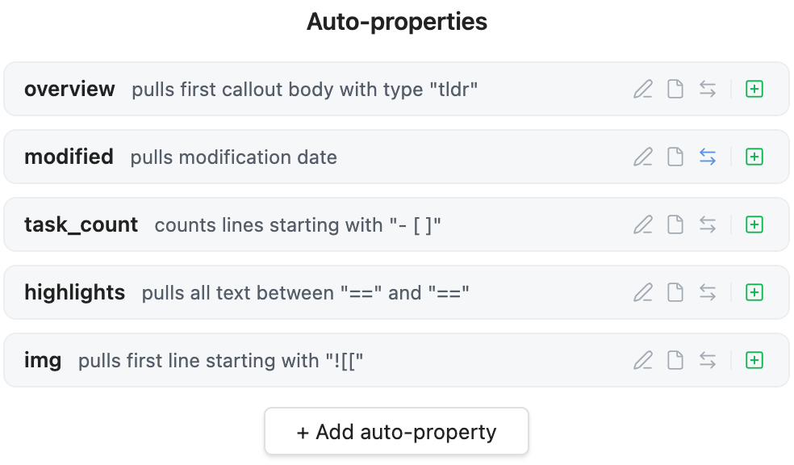
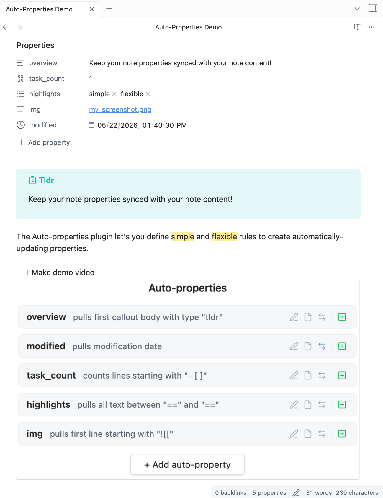

# Auto-Properties

An [Obsidian](https://obsidian.md) plugin that automatically fills note frontmatter properties using configurable rules. Pairs well with Bases, Templates, and Dataview.

> See the [wiki](https://github.com/aarongilly/obsidian-auto-properties/wiki) for examples and full documentation.

---

## How it works

You define rules in the plugin settings. Each rule watches note content and writes a value to a frontmatter property when its trigger fires. Note bodies are **never modified** — only frontmatter properties are written.



---

## Rule types

### Lines
Pulls lines that match a pattern. Match modes: **Starting with**, **Ending with**, **Containing**, **Regex**.

Options: pull first / all / count of matching lines, omit the search string from the result, ignore indentation, pull the next line instead of the matched one, case sensitive.

### Between
Pulls content found between two delimiter strings (e.g. `==highlighted==`, `[[`, `![[`).

Options: separate start and end delimiters, retain delimiters in result, multiline matching, pull first / all / count of matches, case sensitive.

### Headings
Pulls content from under a heading, targeted by level (1–6) or heading text.

Options: heading text only or full section content, include the heading line itself, include subheadings.

### Callouts
Pulls content from callouts, optionally filtered by callout type.

Options: extract header, body, or both; include type label.

### File
Pulls file metadata: name, full path, folder, extension, created date, modified date, or file size.

---

## Triggers (per rule)

Each rule independently controls when it runs:

| Trigger | When |
|---|---|
| **Modify** | Shortly after the note content changes |
| **Open** | Once when the note is first opened |
| **Focus** | When you navigate away from the note |

Rules with no triggers enabled are effectively manual-only — run them via the command palette (`Auto-Properties: Update Auto-Properties`).

---

## Behaviors

| Option | Effect |
|---|---|
| **Enabled** | Toggle a rule on/off without deleting it |
| **Auto-add** | Creates the property in frontmatter if it doesn't exist yet |
| **No overwrite** | Skips the rule if the property already has a non-empty value |

---

## Output & Filters

These apply to the pulled value before it's written:

| Option | Effect |
|---|---|
| **Pull** | First match, all matches (as a list), or count of matches |
| **Strip markdown** | Removes markdown formatting from the result |
| **Trim whitespace** | Strips leading/trailing whitespace |
| **Extract regex** | Replaces the result with the first regex match, or the first capture group if present |
| **Value format** | Template string wrapping the result, e.g. `https://example.com/${result}` |

Available format variables: `${result}`, `${filename}`, `${folder}`, `${path}`, `${created}`, `${modified}`.

---

## Scope (per rule)

Each rule can be limited to run only in certain folders, or skipped in others:

- **Run in folders** — only process notes whose path starts with one of these
- **Ignore folders** — skip notes whose path starts with one of these

Ignore wins if both match. Leave both empty to run on all notes.

---

## Import / Export

Rules can be exported as JSON to your clipboard and imported back (append to existing or replace all). This makes sharing rule sets or moving between vaults easy.

<details>
<summary>Example rules</summary>



```json
[
  {
    "key": "overview",
    "autoadd": true,
    "strip_markdown": true,
    "type": "callouts",
    "callout_type": "tldr"
  },
  {
    "key": "modified",
    "autoadd": true,
    "trigger": [
      "focus_change"
    ],
    "type": "file",
    "file_pull": "modified"
  },
  {
    "key": "task_count",
    "autoadd": true,
    "value": "- [ ]",
    "pull": "count",
    "ignore_indentation": true
  },
  {
    "key": "highlights",
    "autoadd": true,
    "type": "between",
    "pull": "all",
    "start": "=="
  },
  {
    "key": "img",
    "autoadd": true,
    "value": "![["
  }
]
```

</details>

---

## Design principles

- **Note bodies are never changed.** Only frontmatter properties are written.
- **Everything optional except the property key.** Sane defaults cover all omitted fields.
- **No dependencies.** Zero npm dependencies beyond the Obsidian API.

---

## Installation

[Listed in the Obsidian Community directory!](obsidian://show-plugin?id=auto-properties)

Or install via [BRAT](https://github.com/TfTHacker/obsidian42-brat):

1. Install & enable BRAT
2. In BRAT settings, click **Add Plugin**
3. Paste this repo's URL
4. Done
